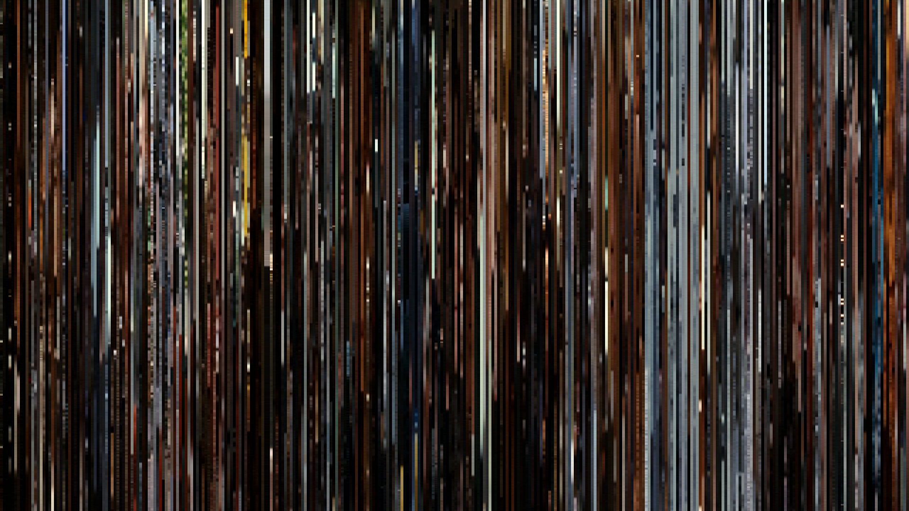

# movbar — Stremio Movie Barcode Addon

Replaces movie & series **background art** in Stremio with a *movie barcode* —
~320 frames evenly sampled across the film, each compressed to a 1px column
and stitched into a 1920×1080 image. The result is a colour-narrative
fingerprint of the whole movie that doubles as backdrop art.


*Inception (2010) — orange/teal palette, dream-sequence brights, snow act
visible as bright cluster, dark dream interiors as black bars.*

## How it works

`movbar` resolves the same Real-Debrid–cached stream Stremio would play
(via [Torrentio](https://torrentio.strem.fun/)), then issues
**parallel HTTP byte-range seeks** with `ffmpeg -ss T -i URL -frames:v 1`
to grab one frame near each sample point. The frames are compressed to 1px
columns (slice mode) or 1px solid colours (avg mode) and stitched with
Pillow.

This avoids downloading the movie. A 2.5 hour film renders in **~5–10
minutes** with 12 concurrent ffmpeg seeks.

```
Stremio detail page
        │
        ▼
GET /meta/movie/tt1375666.json    ◄── addon.js (Stremio SDK)
        │
        ├─ fetch Cinemeta meta
        ├─ if cache/tt1375666_slice.png exists:
        │       meta.background = /barcode/tt1375666_slice.png
        └─ else: spawn worker.py in background

worker.py
        │
        ├─ Torrentio → pick best RD-cached x264 1080p stream
        ├─ ffprobe duration
        ├─ 320 × ffmpeg -ss T -i URL -frames:v 1 (12-way parallel)
        ├─ Pillow stitch → cache/<imdb>_<mode>.png
        └─ next /meta request hits the cache
```

## Why not just decode the whole movie?

Most existing movie-barcode tools (`mckelvin/moviebarcode`, `moviebarcode.tumblr.com`'s
pipeline, etc.) require the file locally and decode every frame. movbar runs
against streaming URLs and decodes ~320 keyframes per film — bandwidth use is
~50–200 MB depending on encoding and keyframe density.

The trick: Real-Debrid (and most CDN-style HTTP servers) honour `Range:`
requests but throttle long sequential reads. `ffmpeg -ss T -i URL` with
`-noaccurate_seek` issues a single Range request to the keyframe offset
instead of streaming forward — every sample is independent, parallelisable,
and stays under the throttle.

## Modes

- **slice** *(default)* — centre 1px column from each sampled frame, scaled
  to 1080 tall with Lanczos. Keeps vertical composition (sky → ground
  gradient is visible). The classic *moviebarcode* look.
- **avg** — area-average each frame to 1×1, then stretch to 1×1080. Cleaner,
  more abstract, reads better as a small thumbnail.

## Install / run

```bash
git clone https://github.com/dknos/movbar.git
cd movbar
npm install
pip install Pillow
node addon.js
```

Open `http://127.0.0.1:9450/manifest.json` in Stremio (Add-ons →
Community → Add a community add-on).

### Required env

`worker.py` reads `~/.nemoclaw_env` for `REALDEBRID_TOKEN`. To use a
different env path or pass the token directly, edit the `ENV` loader at the
top of `worker.py`. (PR welcome — there's no good reason it shouldn't read
`process.env.REALDEBRID_TOKEN` too.)

### Optional env

| Var | Default | Purpose |
|---|---|---|
| `PORT` | `9450` | HTTP listen port |
| `MOVBAR_PUBLIC_HOST` | `127.0.0.1:$PORT` | Host inserted into `meta.background` URLs |
| `MOVBAR_SCHEME` | `http` | Scheme for those URLs (`https` if behind a tunnel) |
| `MOVBAR_MODE` | `slice` | `slice` or `avg` — render mode for new barcodes |
| `PYTHON` | `python3` | Python interpreter to invoke `worker.py` with |

For a public install (Stremio on a Fire TV / phone reaching your render
host), terminate TLS in front and set
`MOVBAR_PUBLIC_HOST=movbar.example.com` and `MOVBAR_SCHEME=https`.
[cloudflared](https://github.com/cloudflare/cloudflared) quick tunnels work
fine for testing:

```bash
cloudflared tunnel --url http://localhost:9450
# then export the printed *.trycloudflare.com hostname
export MOVBAR_PUBLIC_HOST=<hostname>.trycloudflare.com
export MOVBAR_SCHEME=https
node addon.js
```

## Endpoints

| Path | What |
|---|---|
| `GET /manifest.json` | Stremio addon manifest |
| `GET /meta/<type>/<id>.json` | Cinemeta proxy with `meta.background` overridden when a barcode is cached, otherwise kicks off render |
| `GET /barcode/<imdb>_<mode>.png` | Cached barcode |
| `GET /trigger/<imdb>?mode=slice\|avg` | Force-trigger render (debug) |
| `GET /` | Status page |

## Direct CLI render

`worker.py` works standalone:

```bash
python3 worker.py tt1375666 --mode slice --samples 320 --parallel 12
# → cache/tt1375666_slice.png
```

Flags: `--mode {slice,avg}`, `--samples N` (default 320), `--parallel N`
(default 12), `--season N --episode N` for series-episode-specific
barcodes, `--force` to overwrite cached output.

## Performance notes

| Movie | Container | Samples | Parallel | Time |
|---|---|---|---|---|
| Inception 2:28 | x264 BDRip MKV | 64 | 8 | ~1m40s |
| Inception 2:28 | x264 BDRip MKV | 320 | 12 | ~7m |

Time scales roughly linearly with `samples / parallel`. The wall is the RD
HTTP latency × moov re-parse per ffmpeg invocation, not local CPU. Cranking
parallel past ~16 stops helping (RD throttles per-IP).

## Limitations

- **First-view miss.** First time a movie is opened, the barcode isn't ready
  yet, so the default Cinemeta backdrop is shown. Refresh after ~5–10 min
  to see the barcode. (A persistent `inflight.json` and a "render queue"
  page are on the to-do.)
- **Series**: currently the *first* RD-cached file matching the show is
  used, not per-episode. Per-episode barcodes are supported by the worker
  (`--season --episode`) but the addon doesn't drive that yet — open issue
  if you want it.
- **HDR / Remux**: skipped by the stream picker — they decode 5–10× slower
  than x264 and don't materially improve barcode quality.

## Stack

- [stremio-addon-sdk](https://github.com/Stremio/stremio-addon-sdk) — Stremio addon protocol
- ffmpeg + ffprobe — frame extraction
- [Pillow](https://pillow.readthedocs.io) — column stitch
- [Torrentio](https://torrentio.strem.fun/) — RD cache resolver

## License

MIT — see [LICENSE](LICENSE).

## Credits

Inspired by Brendan Dawes' *[CinemaRedux](http://www.brendandawes.com/projects/cinemaredux)*,
the *moviebarcode* tumblr, and [ata4's barcode gist](https://gist.github.com/ata4/e01710f5176cc97c9b5b).
